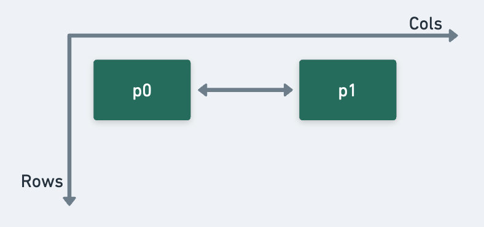
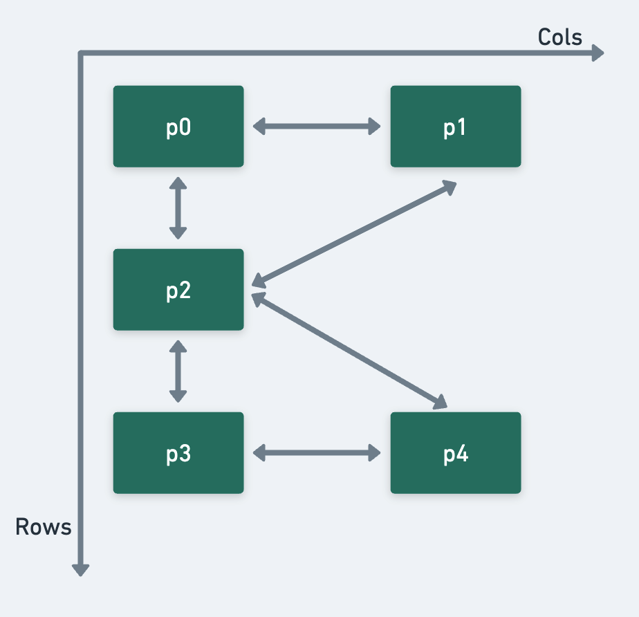

# ThRust

ThRust is a Rust crate that provides a framework for thermodynamic and probabilistic computing. This package currently supports the following features:

* Basic pbit gates: `COPY`, `NOT`, `AND`, `OR`.
* Basic p-circuit compilation and composability.
* p-circuit simulation through Markov Chain Monte Carlo sampling.

## Tutorial
 
`GridPbit`'s are used to construct a 2D lattice.

		let p0 = GridPbit::new(0, 0);
		let p1 = GridPbit::new(0, 1);

This construction can be visualized in the following way:

Pbits can then be used as inputs to probabilistic spin logic (PSL) gates:

		let cp0 = Copy::new(p0, p1);

A set of PSL gates can be used to construct a p-circuit:

	let circuit = Circuit::new();
	circuit.append(Box::new(cp0));
	circuit.compile();

Alternatively, circuits can be created from a vector of PSL gates:

	let circuit = Circuit::from_vector(vec![Box::new(cp0)]);
	circuit.compile();

Finally, create a new simulator to find the ground state configurations via Markov chain Monte Carlo

	let mut sim = MCMC::new(circuit);
	sim.run();

### Composability
ThRust also implements basic p-circuit composability. For example, here's an example of a two-gate p-circuit:

	let p1 = GridPbit::new(0, 0);
	let p2 = GridPbit::new(0, 1);
	let p3 = GridPbit::new(1, 0);
	let p4 = GridPbit::new(2, 0);
	let p5 = GridPbit::new(2, 1);

	let mut circuit = Circuit::new();
	circuit.append(Box::new(And::new(p1, p2, p3)));
	circuit.append(Box::new(Or::new(p3, p4, p5)));
	circuit.compile();

	let mut sim = MCMC::new(circuit);
	sim.run();

## Future Additions

Running list of features to implement:
* Circuit compilation for disjoint circuits
* More robust algorithm for circuit compilation
* Better plotting implementation with more options
* Compute and report observables including confiuration energy
* Enforce connectivity constraints
* Compile high level code for FPGA hardware implementations

## References

Various references to learn more about probabilistic computing.
1) [p-Bits for Probabilistic Spin Logic](https://arxiv.org/pdf/1809.04028.pdf)
2) [Massively Parallel Probabilistic Computing with Sparse Ising Machines](https://arxiv.org/pdf/2110.02481.pdf)

## Citation

If you use this repository, please cite!

## License

See the [LICENSE](https://github.com/chaseklvk/thrust/blob/main/LICENSE) file.
